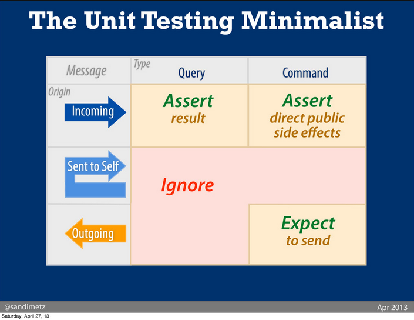

# Angular Unit Testing Standards

## Abstract

Unit testing can be describe as:

For every automatic action that occurs on controller initialization, or any controller method invoked in scope, test the following:

1. Given correct input, does it call the expected external methods/query the expected external resources.
2. Given correct results from all external methods/resources, does it generate the expected response.

If required by design:

3. Given incorrect input, does it refuse the input with useful errors.
4. Given incorrect results from external methods/resources, does it generate useful errors.

It should be immediately obvious what a test is testing, and why.  If it isn't obvious, comments explaining/justifying the test assertions should be added.

When unit testing, we want to test at the smallest level possible.

## Libraries

| Docs | Help | Keywords |
| ---- | ---- | -------- |
| [ngMock](https://docs.angularjs.org/api/ngMock) | [ngMock.md](ngMock.md) | `module`, `inject`, `$controller`, `$httpBackend` |
| [Sinon](http://sinonjs.org/docs/) | [sinon.md](sinon.md) | `stub`, `spy`, `called` |
| [Chai](http://chaijs.com/api/bdd/) | [chai.md](chai.md) | `expect`, `to`, `equal`, `be` |
| [Sinon-chai](https://github.com/domenic/sinon-chai) | N/A | `to.have.been.called` (allows better chaining) |
| [Mocha](http://mochajs.org/) | [mocha.md](mocha.md) | `describe`, `it`, `before`, `beforeEach`, `after`, `afterEach` |
| [Karma](http://karma-runner.github.io/) | N/A | Simply runs the tests |

## What do I test?

Credit to Sandi Metz from [her talk at RailsConf 2013](https://www.youtube.com/watch?v=URSWYvyc42M).

